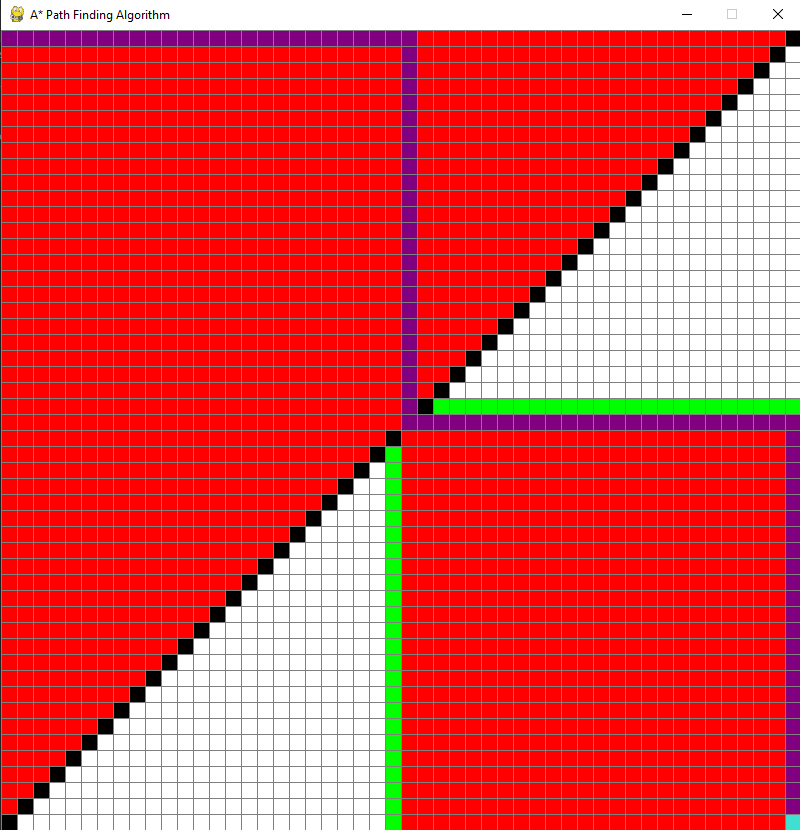

### A* Pathfinding Algorithm
Pathfinding or pathing is the plotting, by a computer application, of the shortest route between two points

## 🤝 Contributing

Contributions, issues and feature requests are welcome! Feel free to check [issues page](https://github.com/gavincapriola/pathfinding/issues).

## Show your support
Give a ⭐️ if this project helped you!
